# Data Eng project

A project that shows how one could extract data from a data source and distribute this data to a stakeholder by developing an analytical dashboard, We will focus only on getting data beyond the external data source, so we are assuming that you already have a data process that dumps data into AWS S3 buckets. You can use fake data to practice the process.

# Overview

# Steps that we will see:

# - How to dump and Extract data from some source 
           In this project we will cover how to get dump and get data from aws S3 and another approach using pyspark

# - Dump the data into a SQL managment tool where the B.I analysts can use to develop data analysis 
           we can use redshift managment tool and a python approach to dump data into postgresql
  
# - Connect the databases we Develop and create a dashboard with the data to understand data patterns.
  

The main objective is to show how to create a simple data pipeline and how a data analyst can use some scalabe tools that will work based on the project requirements, the S3 bucket is a widely used tool to storage and distribute data across the organization data systems and redshift is a friendly aws service that is also powerfull to provide data and data accessibility due to aws governance policies, and redshift also allows us to connect and create a Power bi dashboard with our data to answer mapped questions.


  
We will also try to do the same process but using a jupyter notebook using spark and pyspark to get data from s3/test_folder and create a database on postgresql which allows us to connect and create a Power bi dashboard with our data to answer mapped questions. We will use postgresql as a second option to show that we can use different approachs for the same problem and offer different solutions to the stakeholders necessities.

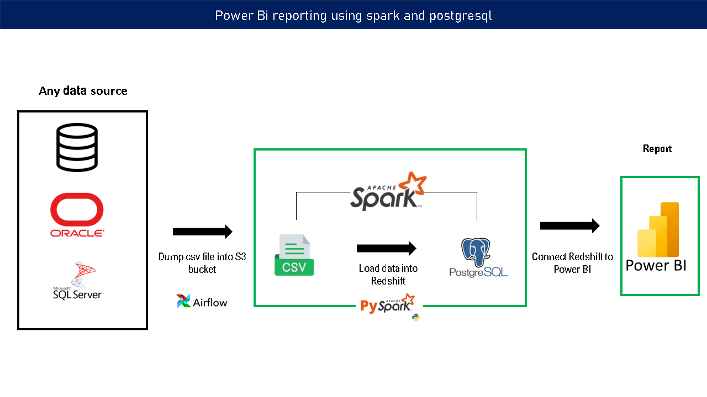
 

## Prerequisites

Directions or anything needed before running the project.

- Aws account 
- Spark installed , to see more information check the apache documentation https://spark.apache.org/docs/latest/
- Postgresql installed , download here https://www.postgresql.org/download/
- Any IDE 

## How to Run The s3 redshift data pipeline Project

Replace the example step-by-step instructions with your own.
* You might have several s3 buckets on your organization and you can use those files in this process to create a whole set of databases on redshift
* We are assuming that you do not have any s3 bucket and it starting to know the tools i've mentioned before.

## Create a s3 bucket

1. Open your AWS console and open the s3 service*

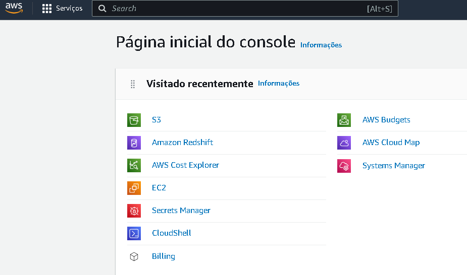

2. Click on 'creat bucket'

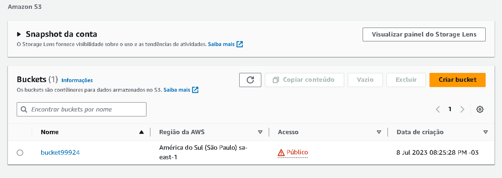

3. Choose your bucket name 

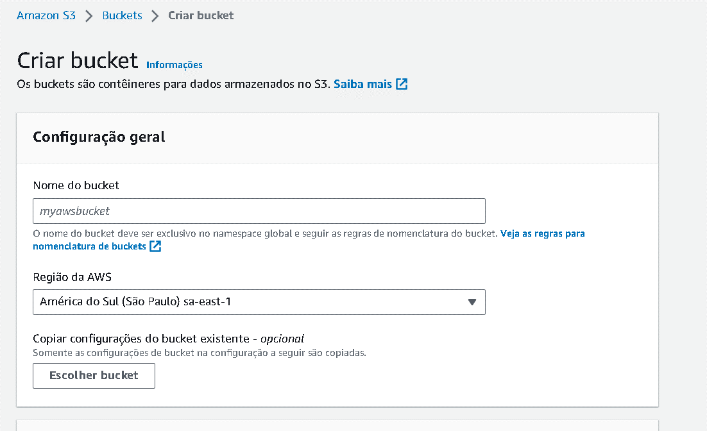

4. you can get any type of data you want to practice at https://www.kaggle.com/datasets

5. Dump the csv files you have downloaded into the s3 bucket you have created
   
   NOTES: You can see that my bucket is public for teaching purposes, but at any organization this is a major security problem and should be addressed                                             properly or else it could generate serious consequences due to data leaking.
   
## Create a redshift cluster and a database  

1. On your AWS console open the redshift service

2. Create a cluster, make sure to use the proper configurations to not get overcharged (check the doc to more details https://docs.aws.amazon.com/redshift/latest/gsg/rs-gsg-launch-sample-cluster.html)

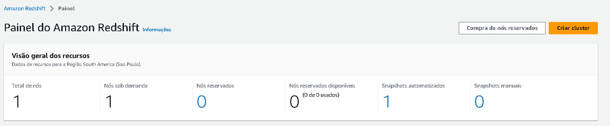

3. Get your cluster running and open the redshift workbench

4. On the redshift workbench create a database and choose a name

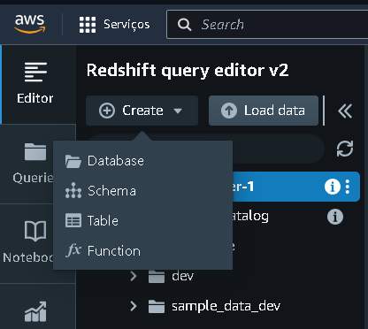

5. Load the data from you s3 bucket on the database you created , make sure that you have the necessery permissions to acess the bucket from the redshift

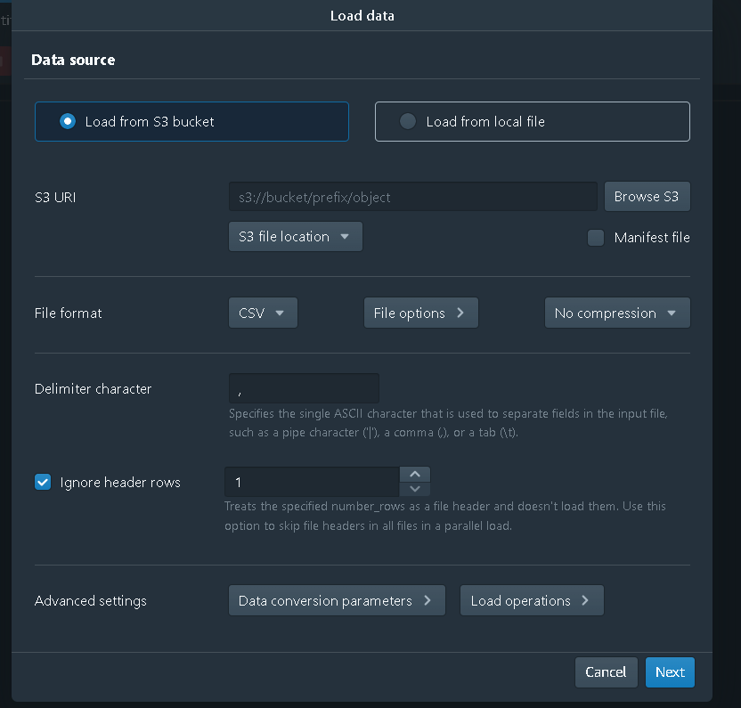

## Redshift data and databases

I have loaded some data of a fake retail and wholesale company to mimetize a process where someone would need to get a some data from a s3 bucket and dump this data into a database on redshift and from this point to clean and organize data with SQL and after this process to connect a Power Bi dashboard using the cluster endpoint so a stakeholder could understand,manage and extract data that could help him/her to developt some kpis in order to understand the business environment and to seek for opportunities or threats that could harm the company's outcome.

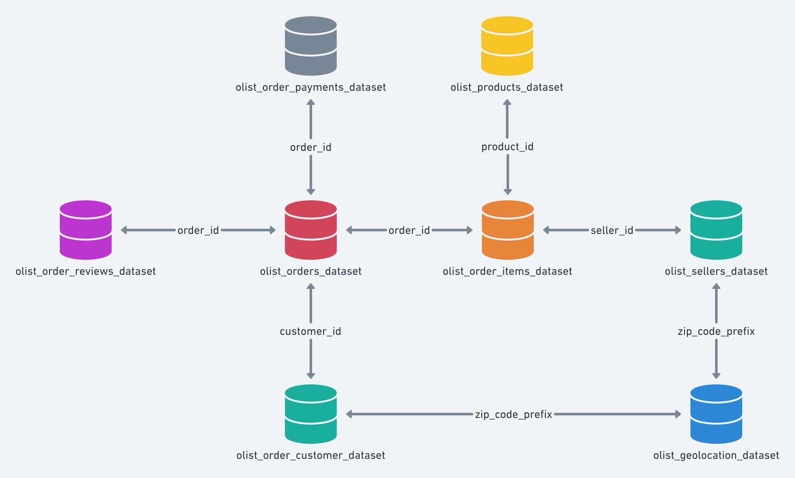

With the schema i get i could create a pareto analysis to show what are the products responsible for 80% of the sales and name them accordingly to the ABC analysis, where A is the top tier products responsible for 80& of the total sales, and B between 80 and 95% or 15 % of the total sales and C the other 5% of the sales, therefore we can see in this type of business what type of products are performing well and those that are not. This is a common approach to control and manage product inventory and could be applied to many business types as drugstores,retails and wholesales, food and beverages.


## SQL Code used on redshift:

### Step 1: Common Table Expressions (CTEs)
The query starts by defining two CTEs: category_summary and pareto_distribution.
1.1. category_summary CTE:
This CTE calculates various summary metrics for each product category, including: 

           the total number of orders (total_de_pedidos), 
           total sales (total_sales), 
           sales per order (sales_per_order), 
           average order value (average_order_value), 
           and sales percentage (sales_percentage).

~~~~
The COUNT(DISTINCT order_id) calculates the count of unique order IDs for each product category.

The SUM(soma_de_price) calculates the total sales for each product category.

The AVG(soma_de_price) calculates the average order value for each product category.

The (SELECT SUM(soma_de_price) FROM schema_v1.tabela_estudos_v1) calculates the total profit across all product categories.
~~~~
### 1.2. pareto_distribution CTE:
~~~~
This CTE extends the category_summary CTE by adding columns related to the Pareto distribution analysis.

The (SELECT SUM(total_sales) FROM category_summary) calculates the total profit across all product categories (total_profit).

The (SELECT SUM(total_sales) * 0.8 FROM category_summary) calculates the threshold for the Pareto distribution (pareto_threshold).

The SUM(total_sales) OVER (ORDER BY total_sales DESC) calculates the cumulative profit for each product category (cumulative_profit).
~~~~
### Step 2: Final Query

The final query selects columns from the pareto_distribution CTE and performs additional calculations for the pareto_category column.

           The product_category_name, 
           total_de_pedidos, 
           total_sales, 
           sales_per_order, 
           average_order_value, 
           and sales_percentage columns are selected directly from the pareto_distribution CTE.
The CASE WHEN statement is used to assign the pareto_category based on the cumulative profit compared to the Pareto threshold.

When the cumulative profit is less than or equal to the Pareto threshold (pareto_threshold), the category is assigned as 'A'.

When the cumulative profit is less than or equal to 95% of the total profit (total_profit * 0.95), the category is assigned as 'B'.

Otherwise, the category is assigned as 'C'.

The result of this query will provide the product category names, total orders, total sales, sales per order, average order value, sales percentage, and the Pareto category ('A', 'B', or 'C') for the top 10 categories based on total sales.

### Pareto query:

~~~~
WITH category_summary AS (
    SELECT
        pr.product_category_name AS categoria_produto,
        COUNT(DISTINCT iord.order_id) AS total_de_pedidos,
        CAST(SUM(iord.price) AS numeric(10, 2)) AS total_sales,
        CAST(SUM(iord.price) / COUNT(DISTINCT iord.order_id) AS numeric(10, 2)) AS sales_per_order,
        CAST(AVG(iord.price) AS numeric(10, 2)) AS average_order_value,
        CAST(SUM(iord.price) / (SELECT SUM(price) FROM bookstore.table_name_order_items) * 100 AS numeric(10, 2)) AS sales_percentage
    FROM
        bookstore.table_name_order_items AS iord
    LEFT JOIN
        bookstore.table_name_products AS pr ON iord.product_id = pr.product_id
    WHERE
        pr.product_category_name IS NOT NULL
    GROUP BY
        pr.product_category_name
    ORDER BY
        total_sales DESC
),
pareto_distribution AS (
    SELECT
        *,
        SUM(total_sales) OVER (ORDER BY total_sales DESC ROWS BETWEEN UNBOUNDED PRECEDING AND CURRENT ROW) AS cumulative_sales,
        SUM(total_sales) OVER () AS total_sum
    FROM
        category_summary
)
SELECT
    pd.categoria_produto,
    pd.total_de_pedidos,
    pd.total_sales,
    pd.sales_per_order,
    pd.average_order_value,
    pd.sales_percentage,
    CASE
        WHEN pd.cumulative_sales <= 0.8 * pd.total_sum THEN 'A'
        WHEN pd.cumulative_sales <= 0.95 * pd.total_sum THEN 'B'
        ELSE 'C'
    END AS pareto_category
FROM
    pareto_distribution AS pd
ORDER BY
    pareto_category ASC;
~~~~

## Connect to Power BI

After we created the pareto analysis on the redshift workbench we need to open a blank power bi file , go to 'get data', type redshift and on the server window paste you endpoint that you can get from your cluster general information page, on the database you paste the name of the database you have created, and in the advanced options you can paste the pareto query to fetch only the analysis we already created.

## rds workbench and Pareto query:
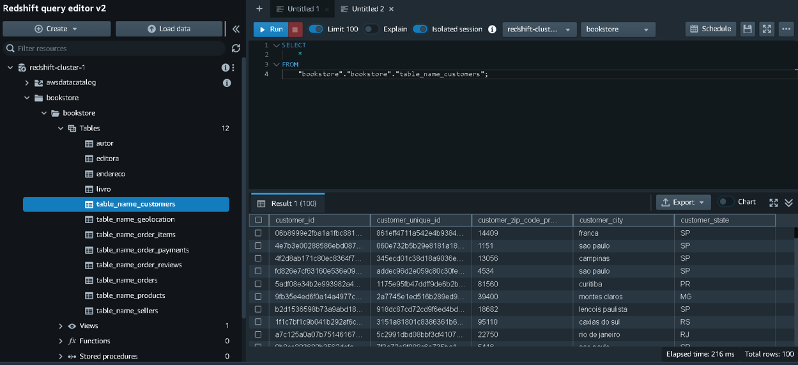


## Connecting using endpoint 

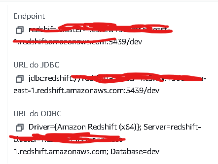

## Insert the query into powerbi file

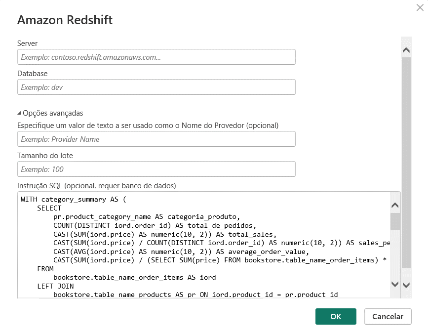

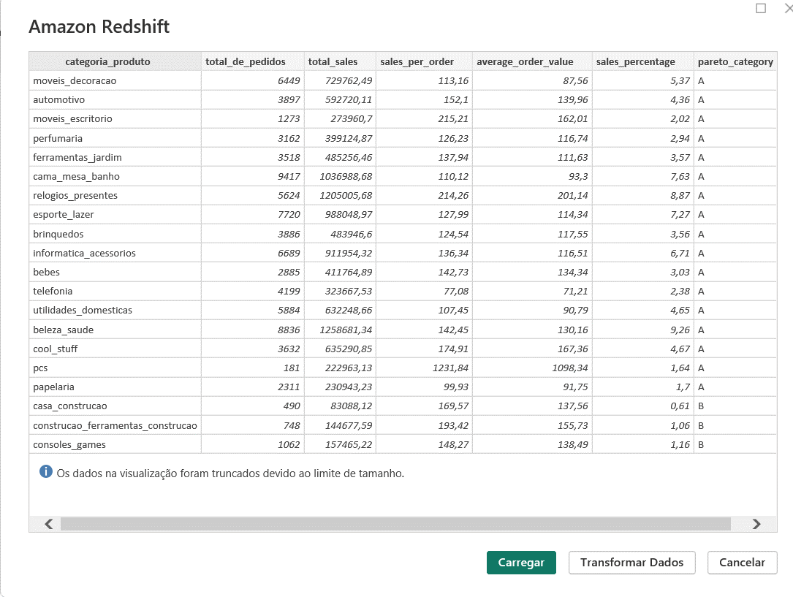

After that we can create a few kpis and a get a few insights to help the stakeholders use data to get better decisions.

 by adding the following lines

           export SPARK_HOME=/opt/spark-3.4.1
           export PATH=$PATH:$SPARK_HOME/bin
           
You can also set you environment variables on windows going to -> system -> system advanced configurations -> environment variables -> new... -> set the name of your variable, for instance SPARK_HOME, JAVA_HOME, HADOOP_HOME,etc... with the name and the path to your application. We will not cover this in details, if you got any problem related to environment variables you should address to the proper documentation. 

NOTE: You also may need to have JAVA jdk installed as well to run spark , check https://www.oracle.com/java/technologies/downloads/ for more details.

## Running spark shell

After downloading and unziping spark apache on your machine you can navigate to your spark folder typing 

           cd spark-3.4.1-bin-hadoop3
           cd bin
           spark-shell
           
Spark should start running but you also should check how to set the proper host and port in  order to allow spark connections with your applications.

## Creating a spark session

Open your ide and create a jupyter notebook file 


```python 
# Import your modules
import findspark
import boto3
import sys
from pyspark.sql import SparkSession
import psycopg2
import os
from pyspark.sql.functions import count,col,asc,desc
from pyspark.sql.types import StringType, IntegerType, FloatType, DoubleType, BooleanType, DateType, TimestampType
findspark.init()

# Create a spark session

# Set the path to the PostgreSQL JDBC driver JAR file
spark_jars_path = r"C:\User\spark\spark-3.4.0-bin-hadoop3\jars\postgresql-42.6.0.jar"

# Configure Spark to use the PostgreSQL JDBC driver
spark = SparkSession.builder \
    .appName("Create PostgreSQL Database") \
    .config("spark.driver.extraClassPath", spark_jars_path) \
    .getOrCreate()

print('session created')

# Configure AWS credentials the hard way

aws_access_key_id = "your_access_key"
aws_secret_access_key = "your_secret_key"

# Configure your AWS credentials the with os getenv

aws_access_key_id = os.getenv("AWS_ACCESS_KEY_ID")
aws_secret_access_key = os.getenv("AWS_SECRET_ACCESS_KEY")

if not aws_access_key_id or not aws_secret_access_key:
    raise ValueError("AWS credentials are not set as environment variables.")

session = boto3.Session(
    aws_access_key_id=aws_access_key_id,
    aws_secret_access_key=aws_secret_access_key
)

# Replace 'your_bucket_name', 'path/to/your/file.csv', and 'your_file.csv' with your actual S3 bucket name, file path, and file name.

bucket_name = 'your_bucket_name'
file_path = 'path/to/your/file.csv'
file_name = 'your_file.csv'

# Create an S3 client
s3_client = session.client('s3')

# Read the file from S3 and store it as a DataFrame using pandas
csv_object = s3_client.get_object(Bucket=bucket_name, Key=file_path)
df = pd.read_csv(csv_object['Body'])

# Now, 'df' contains the data from the CSV file as a pandas DataFrame
print(df.head())

# Or You can read a csv file from any folder just the test the process

df = spark.read.csv('data_full.csv',encoding='utf-8',sep=',', header=True, inferSchema=True)

# You can also define a parquet file from a s3 bucket

s3_parquet_path = "s3://your-bucket-name/path/to/data_full.parquet"

# Then read the Parquet file as a DataFrame

df = spark.read.parquet(s3_parquet_path)

# Show the DataFrame

df.show()
 
# You can check you dataframe schema as well
# Assuming you have a DataFrame named 'df'

df.printSchema()

# set postgres credencials hard way

postgres_host = "your host"
postgres_port = 'any suitable port'
postgres_database = "yourdatabase"
postgres_user = "youruser"
postgres_password = "yourpassword"
new_postgres_database='postgres'
new_schema = "schema_v1"
new_table = "tabela_estudos_v1"

# Create a connection to the default database

default_conn = psycopg2.connect(
    host=postgres_host,
    port=postgres_port,
    dbname="postgres",
    user=postgres_user,
    password=postgres_password
)
default_conn.autocommit = True

# Connect to the newly created database

conn = psycopg2.connect(
    host=postgres_host,
    port=postgres_port,
    dbname=new_postgres_database,
    user=postgres_user,
    password=postgres_password
)
conn.autocommit = True

# Create a cursor to execute SQL statements

cursor = conn.cursor()

# Mapping between Spark data types and PostgreSQL data types

type_mapping = {
    StringType(): "TEXT",
    IntegerType(): "INTEGER",
    FloatType(): "FLOAT",
    DoubleType(): "DOUBLE PRECISION",
    BooleanType(): "BOOLEAN",
    DateType(): "DATE",
    TimestampType(): "TIMESTAMP"
}

# Use the DataFrame schema to create the table in the database

table_columns = ", ".join([f"{field.name} {type_mapping.get(field.dataType, 'TEXT')}" for field in df.schema.fields])
create_table_query = f"CREATE TABLE IF NOT EXISTS schema_v1.{new_table} ({table_columns})"
cursor.execute(create_table_query)

# Insert the data from the DataFrame into the table

df.write \
    .format("jdbc") \
    .option("url", f"jdbc:postgresql://{postgres_host}:{postgres_port}/postgres") \
    .option("dbtable", f"schema_v1.{new_table}") \
    .option("user", postgres_user) \
    .option("password", postgres_password) \
    .mode("append") \
    .save()

# Close the cursor and connection

cursor.close()
conn.close()

# Stop the SparkSession

spark.stop()conn = psycopg2.connect(
    host=postgres_host,
    port=postgres_port,
    dbname=new_postgres_database,
    user=postgres_user,
    password=postgres_password
)
conn.autocommit = True
```
After running this code you should have sent some data to a postgresql schema and created a database if it not existed, you should be able to use SQL to fetch you data now on pgAdmin 4 
## Lessons Learned

WIP

It's good to reflect on what you learned throughout the process of building this project. Here you might discuss what you would have done differently if you had more time/money/data. Did you end up choosing the right tools or would you try something else next time?

## Contact

Please feel free to contact me if you have any questions at: https://www.linkedin.com/in/felipe-mauriz-rodrigues/
