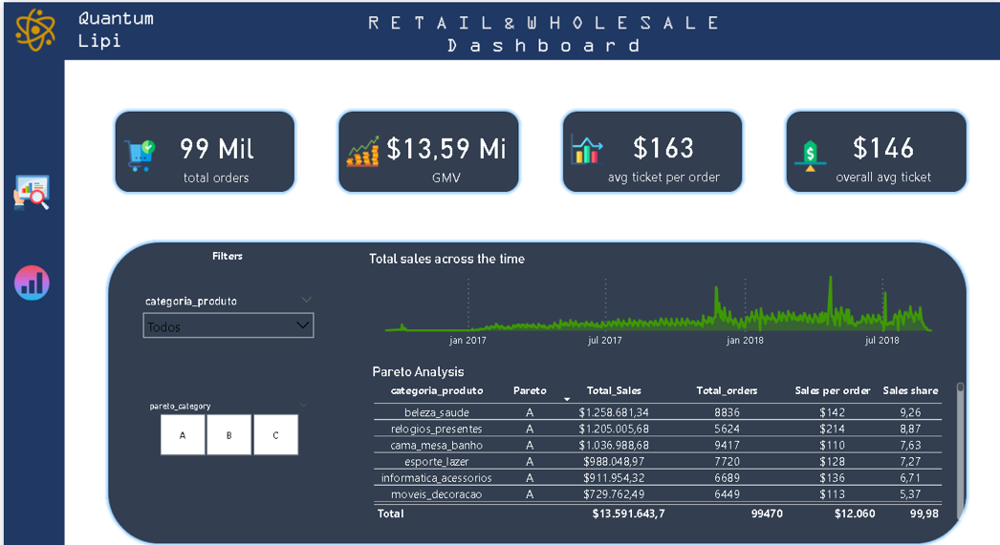
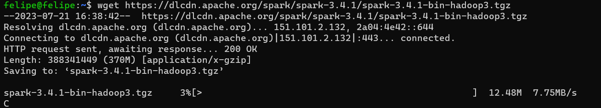
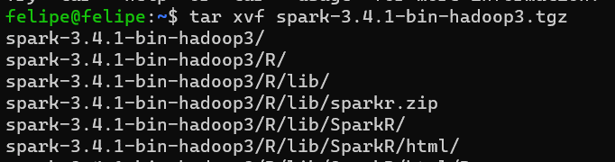
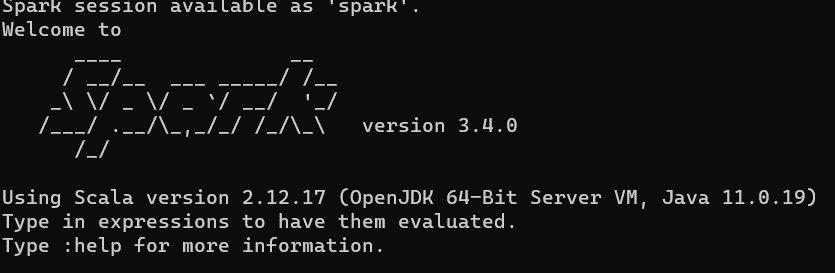
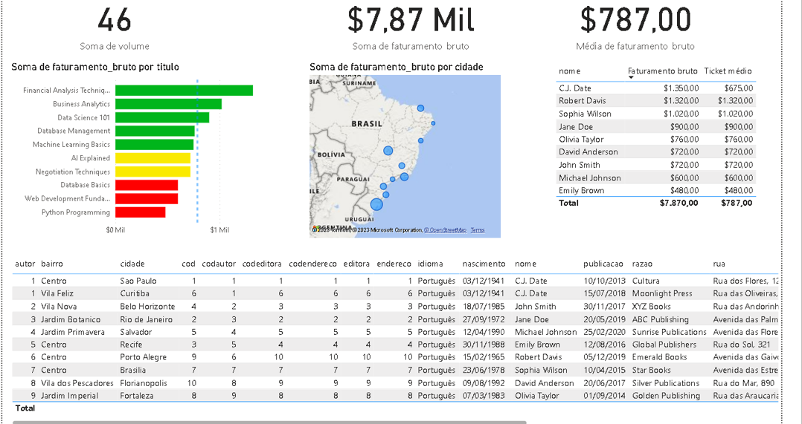

# Project Title: Analytical Dashboard for Data Distribution from AWS S3

Description:

This project demonstrates how to create a simple data pipeline to extract data from AWS S3 and another approach using PySpark. 

We will explore two methods: 

           one that uses AWS S3 to dump and extract data and another that utilizes PySpark to achieve the same. 

The main objective is to showcase scalable tools that cater to project requirements. AWS S3 serves as a widely used tool for storing and distributing data across an organization's data systems, while Redshift provides a powerful SQL management tool that BI analysts can use for data analysis.

# Overview

# Steps that we will see:

Data Extraction: The project will showcase how to efficiently extract data from the AWS S3 bucket using Python and the boto3 library. We will handle authentication by retrieving AWS credentials from environment variables.

Data Preprocessing: The extracted data may need cleaning, transformation, or aggregation before visualization. We will use pandas and PySpark to preprocess the data, making it suitable for analysis.

Dump the Data into a SQL Management Tool: In this project, we will use Redshift as a SQL management tool to store the preprocessed data. This allows BI analysts to use SQL for data analysis.

Database Connection and Dashboard Development: We will connect the databases we develop and create an analytical dashboard with the data to understand data patterns. Leveraging popular data visualization libraries like Dash or Streamlit, the dashboard will include charts, graphs, and other visualizations to provide stakeholders with insights into the data.

Please note that for the sake of simplicity and to practice the data processing steps, we will use fake data. However, the same approach can be applied to real-world data stored in AWS S3 buckets.


  
Additionally, we will explore an alternative approach using Jupyter Notebook, Spark, and PySpark to get data from s3/test_folder and create a database on PostgreSQL. This alternative method demonstrates how different approaches can offer various solutions to stakeholders' necessities.


 

## Skills and Technologies:

Python

Pandas

PySpark

AWS S3

AWS Redshift

Boto3 (for AWS interaction)

PowerBi/tableau (for dashboard development)

Data preprocessing and visualization techniques

## How to Run The s3 redshift data pipeline Project
To run the S3 to Redshift Data Pipeline project, follow the steps below. 
This assumes that you do not have any existing S3 buckets and will start from scratch.

Step 1: Create an S3 Bucket

Open your AWS console and navigate to the S3 service.


Click on the "Create Bucket" button to create a new bucket.


Choose a unique name for your bucket and configure the settings as needed.

You can find practice data from various sources, such as Kaggle datasets.

Upload the CSV files you downloaded from Kaggle or any other source into the S3 bucket you created.

Note: It's important to ensure proper security measures for your S3 bucket to prevent data leakage in a real organization.

Step 2: Create a Redshift Cluster and a Database

On your AWS console, open the Redshift service.

Create a new cluster, being mindful of the configurations to avoid unnecessary costs. Refer to the AWS documentation for more details on this step.


Wait for your Redshift cluster to be in a "Running" state and then open the Redshift Workbench.

Within the Redshift Workbench, create a new database and give it a name.

Step 3: Load Data from S3 into the Redshift Database

Ensure that you have the necessary permissions to access the S3 bucket from the Redshift cluster.

Use the Redshift Workbench to load the data from the S3 bucket you created earlier into the database you just created.


Step 4: Redshift Data and Databases

In this project, we have used data from a fake retail and wholesale company to simulate the process of getting data from an S3 bucket, dumping it into a Redshift database, cleaning, and organizing the data using SQL. The objective is to create a Power BI dashboard to allow stakeholders to understand, manage, and extract data for analyzing key performance indicators (KPIs) and identifying opportunities or threats.

The schema of the retail and wholesale company's data is shown below:


                                                       Retail & Wholesale Schema

With this schema, you can perform various analyses, such as a Pareto analysis to identify the products responsible for 80% of the sales (ABC analysis). This helps to classify products as follows:

A: Top-tier products responsible for 80% of the total sales.
B: Products responsible for sales between 80% and 95% (15% of total sales).
C: Products responsible for the remaining 5% of sales.

This approach is commonly used to manage product inventory and can be applied to various types of businesses, such as drugstores, retailers, wholesalers, food and beverages, and more.

                                                       Pareto 80/20 Rule using ABC Analysis


By following these steps and leveraging the data pipeline from S3 to Redshift, you can gain valuable insights into your data and create meaningful visualizations and analyses using tools like Power BI to make informed business decisions.

Replace the example step-by-step instructions with your own.
* You might have several s3 buckets on your organization and you can use those files in this process to create a whole set of databases on redshift
* We are assuming that you do not have any s3 bucket and it starting to know the tools i've mentioned before.


## SQL Code used on redshift:

### Step 1: Common Table Expressions (CTEs)
The query starts by defining two CTEs: category_summary and pareto_distribution.
1.1. category_summary CTE:
This CTE calculates various summary metrics for each product category, including: 

           the total number of orders (total_de_pedidos), 
           total sales (total_sales), 
           sales per order (sales_per_order), 
           average order value (average_order_value), 
           and sales percentage (sales_percentage).

~~~~
The COUNT(DISTINCT order_id) calculates the count of unique order IDs for each product category.

The SUM(soma_de_price) calculates the total sales for each product category.

The AVG(soma_de_price) calculates the average order value for each product category.

The (SELECT SUM(soma_de_price) FROM schema_v1.tabela_estudos_v1) calculates the total profit across all product categories.
~~~~
### 1.2. pareto_distribution CTE:
~~~~
This CTE extends the category_summary CTE by adding columns related to the Pareto distribution analysis.

The (SELECT SUM(total_sales) FROM category_summary) calculates the total profit across all product categories (total_profit).

The (SELECT SUM(total_sales) * 0.8 FROM category_summary) calculates the threshold for the Pareto distribution (pareto_threshold).

The SUM(total_sales) OVER (ORDER BY total_sales DESC) calculates the cumulative profit for each product category (cumulative_profit).
~~~~
### Step 2: Final Query

The final query selects columns from the pareto_distribution CTE and performs additional calculations for the pareto_category column.

           The product_category_name, 
           total_de_pedidos, 
           total_sales, 
           sales_per_order, 
           average_order_value, 
           and sales_percentage columns are selected directly from the pareto_distribution CTE.
The CASE WHEN statement is used to assign the pareto_category based on the cumulative profit compared to the Pareto threshold.

When the cumulative profit is less than or equal to the Pareto threshold (pareto_threshold), the category is assigned as 'A'.

When the cumulative profit is less than or equal to 95% of the total profit (total_profit * 0.95), the category is assigned as 'B'.

Otherwise, the category is assigned as 'C'.

The result of this query will provide the product category names, total orders, total sales, sales per order, average order value, sales percentage, and the Pareto category ('A', 'B', or 'C') for the top 10 categories based on total sales.

### Pareto query:

~~~~
WITH category_summary AS (
    SELECT
        pr.product_category_name AS categoria_produto,
        COUNT(DISTINCT iord.order_id) AS total_de_pedidos,
        CAST(SUM(iord.price) AS numeric(10, 2)) AS total_sales,
        CAST(SUM(iord.price) / COUNT(DISTINCT iord.order_id) AS numeric(10, 2)) AS sales_per_order,
        CAST(AVG(iord.price) AS numeric(10, 2)) AS average_order_value,
        CAST(SUM(iord.price) / (SELECT SUM(price) FROM bookstore.table_name_order_items) * 100 AS numeric(10, 2)) AS sales_percentage
    FROM
        bookstore.table_name_order_items AS iord
    LEFT JOIN
        bookstore.table_name_products AS pr ON iord.product_id = pr.product_id
    WHERE
        pr.product_category_name IS NOT NULL
    GROUP BY
        pr.product_category_name
    ORDER BY
        total_sales DESC
),
pareto_distribution AS (
    SELECT
        *,
        SUM(total_sales) OVER (ORDER BY total_sales DESC ROWS BETWEEN UNBOUNDED PRECEDING AND CURRENT ROW) AS cumulative_sales,
        SUM(total_sales) OVER () AS total_sum
    FROM
        category_summary
)
SELECT
    pd.categoria_produto,
    pd.total_de_pedidos,
    pd.total_sales,
    pd.sales_per_order,
    pd.average_order_value,
    pd.sales_percentage,
    CASE
        WHEN pd.cumulative_sales <= 0.8 * pd.total_sum THEN 'A'
        WHEN pd.cumulative_sales <= 0.95 * pd.total_sum THEN 'B'
        ELSE 'C'
    END AS pareto_category
FROM
    pareto_distribution AS pd
ORDER BY
    pareto_category ASC;
~~~~

## Connect to Power BI

After completing the Pareto analysis in the Redshift Workbench, follow these steps to connect Power BI to Redshift and fetch the analysis results:

Open a Blank Power BI File:

Launch Power BI and create a new blank file to start building your dashboard.

Get Data from Redshift:

In Power BI, navigate to the "Home" tab on the top ribbon and click on "Get Data."

In the "Get Data" window, search for "Redshift" and select "Amazon Redshift" from the available data sources.
Connect to Redshift:

In the "Amazon Redshift database" window, paste the endpoint URL you obtained from the Redshift cluster's general information page in the "Server" field. 

This URL typically looks like your-cluster-name.xyz123.us-west-2.redshift.amazonaws.com.

Provide the credentials required to connect to your Redshift cluster (username and password).

## Select the Database:

In the "Database" field, paste the name of the database you created in the Redshift cluster.
Load Data into Power BI:

Click "OK" to establish the connection to the Redshift database. Power BI will load the available tables and views from the selected database.
Fetch Pareto Analysis:

In the "Navigator" window, you will see a list of tables/views available in the Redshift database. Find the table/view that contains the results of the Pareto analysis, which you previously created in the Redshift Workbench. 

You can give this view a meaningful name, such as "Pareto Analysis."

Select the "Pareto Analysis" table/view and click "Load" to import the data into Power BI.

## Create the Dashboard:

Power BI will load the data, and you can start building your analytical dashboard using various visualization tools available in Power BI.

Utilize charts, graphs, and tables to visualize the Pareto analysis results and any other relevant insights from the data.

## Refresh Data (Optional):

If your Redshift data is regularly updated, you can set up automatic data refresh in Power BI to ensure your dashboard always shows the latest information.

To do this, navigate to the "Home" tab in Power BI, click on "Refresh" and select the desired refresh frequency.

By following these steps, you can connect Power BI to Redshift, fetch the Pareto analysis results, and create an interactive and insightful dashboard to help stakeholders gain a deeper understanding of the data and make data-driven decisions.

## rds workbench and Pareto query:


## Connecting using endpoint 


## Insert the query into powerbi file


After that we can create a few kpis and a get a few insights to help the stakeholders use data to get better decisions.




## How to Run The pyspark/postgresql data pipeline Project

Before proceeding with the PySpark/PostgreSQL data pipeline project, ensure that you have properly configured your machine to run Apache Spark. 
For more details on configuration, refer to the official documentation: [Apache Spark Documentation](https://spark.apache.org/docs/latest/)


## Running Spark on Your Machine using Ubuntu

Open the Ubuntu Terminal:

Launch the Ubuntu terminal on your machine.

## Download Spark Binaries:

Use the wget command to download the Spark binaries. 
In this example, we are downloading Spark version 3.4.1 with Hadoop 3.

           wget https://dlcdn.apache.org/spark/spark-3.4.1/spark-3.4.1-bin-hadoop3.tgz



## Extract Spark Archive:

Once the download is complete, extract the Spark archive using the following command:
bash

           tar -xvzf spark-3.4.1-bin-hadoop3.tgz



## Set Environment Variables:

Add the Spark binary path and other environment variables to your .bashrc or .bash_profile file. 

Replace your_spark_path with the actual path where Spark is extracted.

           export SPARK_HOME=your_spark_path
           export PATH=$SPARK_HOME/bin:$PATH

## Source the Updated File:

Source the updated .bashrc or .bash_profile file to apply the changes immediately.

           source ~/.bashrc

           source ~/.bash_profile
           
## Verify Spark Installation:

To verify that Spark is installed and configured correctly, run the following command:
           
           cd spark-3.4.1-bin-hadoop3
           cd bin
           spark-shell
           


This should launch the Spark shell, indicating that Spark is installed and ready to use.

## Run the PySpark/PostgreSQL Data Pipeline Project:

With Spark set up on your machine, you can proceed with the PySpark/PostgreSQL data pipeline project, where you will learn how to use PySpark to process data and create a PostgreSQL database to store and manage the preprocessed data.


## Creating a spark session

Open your ide and create a jupyter notebook file 


```python 
# Import your modules
import findspark
import boto3
import sys
from pyspark.sql import SparkSession
import psycopg2
import os
from pyspark.sql.functions import count,col,asc,desc
from pyspark.sql.types import StringType, IntegerType, FloatType, DoubleType, BooleanType, DateType, TimestampType
findspark.init()

# Create a spark session

# Set the path to the PostgreSQL JDBC driver JAR file
spark_jars_path = r"C:\User\spark\spark-3.4.0-bin-hadoop3\jars\postgresql-42.6.0.jar"

# Configure Spark to use the PostgreSQL JDBC driver
spark = SparkSession.builder \
    .appName("Create PostgreSQL Database") \
    .config("spark.driver.extraClassPath", spark_jars_path) \
    .getOrCreate()

print('session created')

# Configure AWS credentials the hard way

aws_access_key_id = "your_access_key"
aws_secret_access_key = "your_secret_key"

# Configure your AWS credentials the with os getenv

aws_access_key_id = os.getenv("AWS_ACCESS_KEY_ID")
aws_secret_access_key = os.getenv("AWS_SECRET_ACCESS_KEY")

if not aws_access_key_id or not aws_secret_access_key:
    raise ValueError("AWS credentials are not set as environment variables.")

session = boto3.Session(
    aws_access_key_id=aws_access_key_id,
    aws_secret_access_key=aws_secret_access_key
)

# Replace 'your_bucket_name', 'path/to/your/file.csv', and 'your_file.csv' with your actual S3 bucket name, file path, and file name.

bucket_name = 'your_bucket_name'
file_path = 'path/to/your/file.csv'
file_name = 'your_file.csv'

# Create an S3 client
s3_client = session.client('s3')

# Read the file from S3 and store it as a DataFrame using pandas
csv_object = s3_client.get_object(Bucket=bucket_name, Key=file_path)
df = pd.read_csv(csv_object['Body'])

# Now, 'df' contains the data from the CSV file as a pandas DataFrame
print(df.head())

# Or You can read a csv file from any folder just the test the process

df = spark.read.csv('data_full.csv',encoding='utf-8',sep=',', header=True, inferSchema=True)

# You can also define a parquet file from a s3 bucket

s3_parquet_path = "s3://your-bucket-name/path/to/data_full.parquet"

# Then read the Parquet file as a DataFrame

df = spark.read.parquet(s3_parquet_path)

# Show the DataFrame

df.show()
 
# You can check you dataframe schema as well
# Assuming you have a DataFrame named 'df'

df.printSchema()

# set postgres credencials hard way

postgres_host = "your host"
postgres_port = 'any suitable port'
postgres_database = "yourdatabase"
postgres_user = "youruser"
postgres_password = "yourpassword"
new_postgres_database='postgres'
new_schema = "schema_v1"
new_table = "tabela_estudos_v1"

# Create a connection to the default database

default_conn = psycopg2.connect(
    host=postgres_host,
    port=postgres_port,
    dbname="postgres",
    user=postgres_user,
    password=postgres_password
)
default_conn.autocommit = True

# Connect to the newly created database

conn = psycopg2.connect(
    host=postgres_host,
    port=postgres_port,
    dbname=new_postgres_database,
    user=postgres_user,
    password=postgres_password
)
conn.autocommit = True

# Create a cursor to execute SQL statements

cursor = conn.cursor()

# Mapping between Spark data types and PostgreSQL data types

type_mapping = {
    StringType(): "TEXT",
    IntegerType(): "INTEGER",
    FloatType(): "FLOAT",
    DoubleType(): "DOUBLE PRECISION",
    BooleanType(): "BOOLEAN",
    DateType(): "DATE",
    TimestampType(): "TIMESTAMP"
}

# Use the DataFrame schema to create the table in the database

table_columns = ", ".join([f"{field.name} {type_mapping.get(field.dataType, 'TEXT')}" for field in df.schema.fields])
create_table_query = f"CREATE TABLE IF NOT EXISTS schema_v1.{new_table} ({table_columns})"
cursor.execute(create_table_query)

# Insert the data from the DataFrame into the table

df.write \
    .format("jdbc") \
    .option("url", f"jdbc:postgresql://{postgres_host}:{postgres_port}/postgres") \
    .option("dbtable", f"schema_v1.{new_table}") \
    .option("user", postgres_user) \
    .option("password", postgres_password) \
    .mode("append") \
    .save()

# Close the cursor and connection

cursor.close()
conn.close()

# Stop the SparkSession

spark.stop()conn = psycopg2.connect(
    host=postgres_host,
    port=postgres_port,
    dbname=new_postgres_database,
    user=postgres_user,
    password=postgres_password
)
conn.autocommit = True
```
After running this code you should have sent some data to a postgresql schema and created a database if it not existed, you should be able to use SQL to fetch you data now on pgAdmin 4.

## Connect Postgresql to Power Bi

Open a Power Bi file and go to 'get data' then type 'postgresql' , put your server and the database you want to access , then it should ask for your credentials and after that you should see the tables available at your database.



## Lessons Learned

By completing this project, i could gain valuable hands-on experience in data extraction from AWS S3, redshift, postgresql, apache spark, data preprocessing, and the development of analytical dashboards. Additionally, i have learned how to present data insights effectively to stakeholders, contributing to better decision-making processes.

## Contact

Please feel free to contact me if you have any questions at: https://www.linkedin.com/in/felipe-mauriz-rodrigues/
