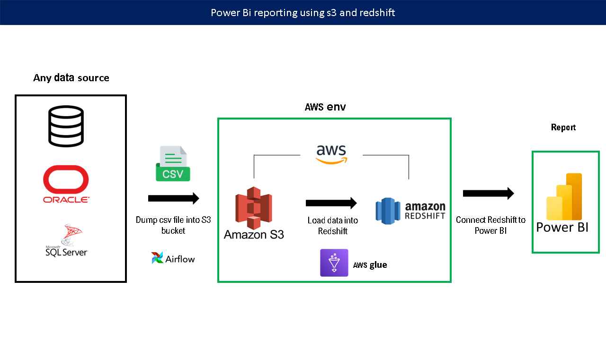
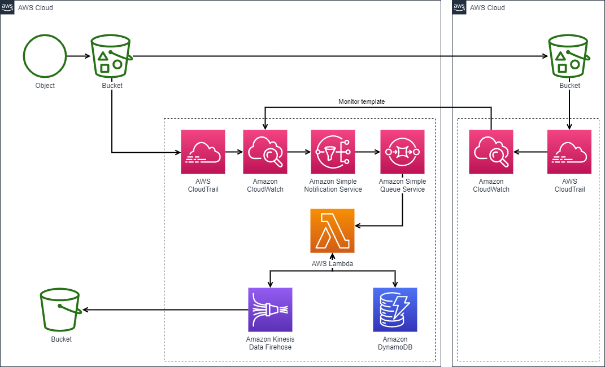

# Data Eng project

A project that shows how one could extract data from a data source and distribute this data to a stakeholder by developing an analytical dashboard, We will focus only on getting data beyond the external data source, so we are assuming that you already have a data process that dumps data into AWS S3 buckets. You can use fake data to practice the process.

## Overview
Steps that we will see:

### - How to dump and Extract data from some source 
-- In this project we will cover how to get dump and get data from aws S3 and another approach using pyspark

### - Dump the data into a SQL managment tool where the B.I analysts can use to develop data analysis 
-- we can use redshift managment tool and a python approach to dump data into postgresql
  
### - Connect the databases we Develop and create a dashboard with the data to understand data patterns.

### *This is just a simplified chart that illustrate what tools we will cover  
.

### The main objective is to show how to create a simple data pipeline and how a data analyst can use some scalabe tools that will work based on the project requirements, the S3 bucket is a widely used tool to storage and distribute data across the organization data systems and redshift is a friendly aws service that is also powerfull to provide data and data accessibility due to aws governance policies, and redshift also allows us to connect and create a Power bi dashboard with our data to answer mapped questions.
  
### We will also try to do the same process but using a jupyter notebook using spark and pyspark to get data from s3/test_folder and create a database on postgresql which allows us to connect and create a Power bi dashboard with our data to answer mapped questions. We will use postgresql as a second option to show that we can use different approachs for the same problem and offer different solutions to the stakeholders necessities.

 

If you decide to include this, you should also talk a bit about why you chose the architecture and tools you did for this project.

## Prerequisites

Directions or anything needed before running the project.

- Prerequisite 1
- Prerequisite 2
- Prerequisite 3

## How to Run This Project

Replace the example step-by-step instructions with your own.

1. Install x packages
2. Run command: `python x`
3. Make sure it's running properly by checking z
4. To clean up at the end, run script: `python cleanup.py`

## Lessons Learned

It's good to reflect on what you learned throughout the process of building this project. Here you might discuss what you would have done differently if you had more time/money/data. Did you end up choosing the right tools or would you try something else next time?

## Contact

Please feel free to contact me if you have any questions at: LinkedIn, Twitter
